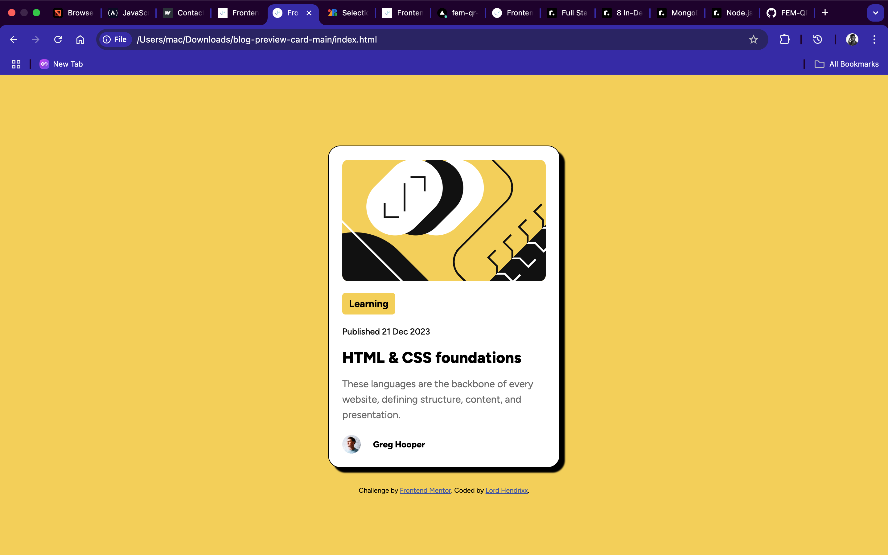

# Frontend Mentor - Blog preview card solution

This is a solution to the [Blog preview card challenge on Frontend Mentor](https://www.frontendmentor.io/challenges/blog-preview-card-ckPaj01IcS). Frontend Mentor challenges help you improve your coding skills by building realistic projects. 

## Table of contents

- [Overview](#overview)
  - [The challenge](#the-challenge)
  - [Screenshot](#screenshot)
  - [Links](#links)
- [My process](#my-process)
  - [Built with](#built-with)
  - [What I learned](#what-i-learned)
  - [Continued development](#continued-development)
  - [Useful resources](#useful-resources)
- [Author](#author)
- [Acknowledgments](#acknowledgments)

## Overview

### The challenge

Users should be able to:

- See hover and focus states for all interactive elements on the page

### Screenshot

### Links

- Solution URL: [Vercel](https://blog-card-project-git-main-beealmightys-projects.vercel.app/)

## My process

### Built with

- Semantic HTML5 markup
- CSS custom properties
- Flexbox
- Mobile-first workflow.
- CSS Media Queries

### What I learned
- I learnt how structure is mainly semantics for proper CSS flexbox application.
- I learnt how to properly apply CSS media queries with a mobile first workflow in mind.

### Continued development

- I want to work more on responsive web design for all screen sizes.
- I want to add functionality to my projects with Javascript and Javascript frameworks like React.
- I want to delve into CSS transitions, CSS grid and animations as well.

### Useful resources

- [W3 schools](https://www.w3schools.com) - This helped me for XYZ reason. I really liked this pattern and will use it going forward.

## Author
- Frontend Mentor - [BeeAlmighty](https://www.frontendmentor.io/profile/beeAlmighty)
- Twitter - [Moses Maduakonam](https://www.twitter.com/Maduakonam67451)

## Acknowledgments
I want thank W3 schools for their help in curating concise and really helpful contents.
